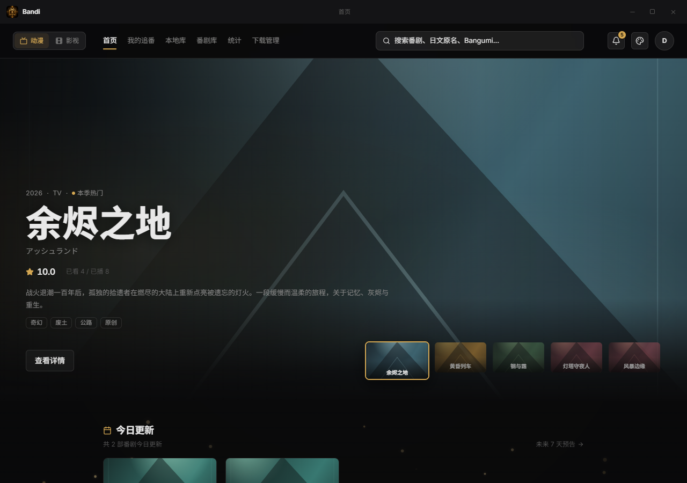
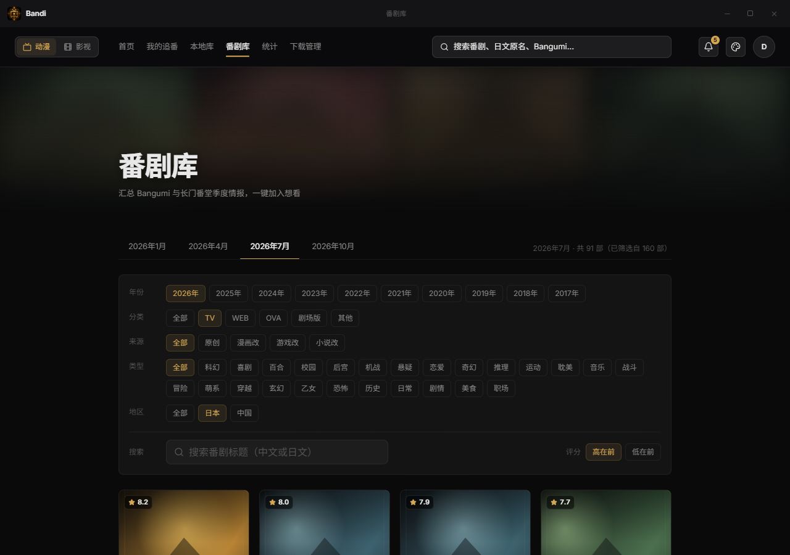
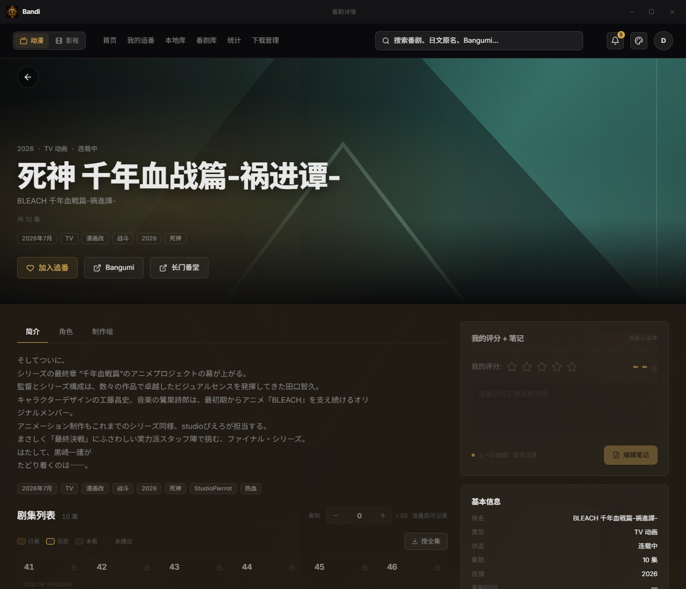
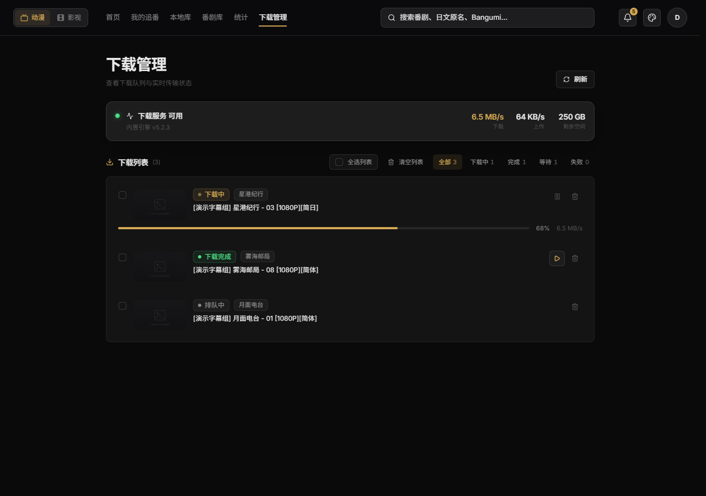
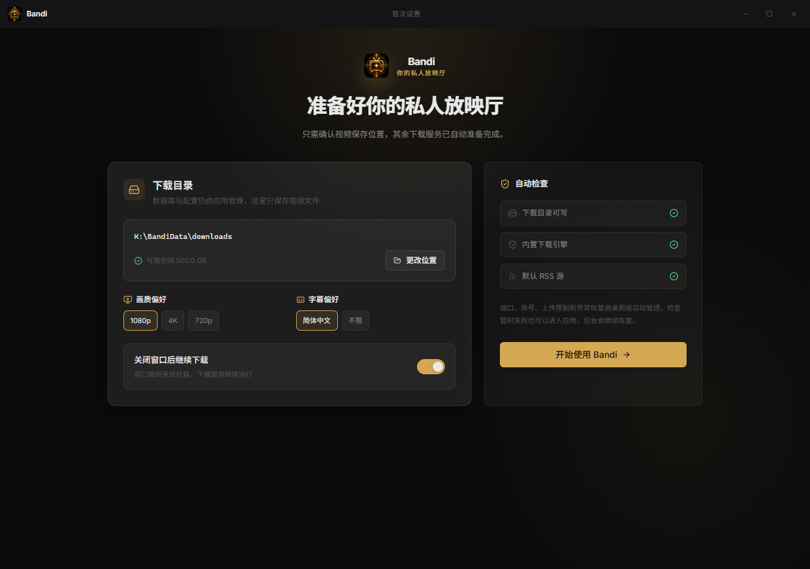

<p align="center">
  
</p>

<h1 align="center">追番中心 · Bandi</h1>

<p align="center">
  Windows 本地优先的私人追番与媒体中心<br>
  今天看什么、看到第几集、下一集什么时候来，打开一个窗口就知道。
</p>

<p align="center">
  <a href="https://github.com/Luis-Herry/anime-tracker-desktop/releases">下载桌面版</a>
  ·
  <a href="#第一次启动">第一次启动</a>
  ·
  <a href="#怎么玩">看看怎么玩</a>
  ·
  <a href="#本地开发">参与开发</a>
</p>



追番中心把季初选番、日常追更、RSS 找源、后台下载、本地播放和观看统计接成一条完整路线。你可以把它当作私人放映厅的前台：作品资料从公开数据源补齐，观看进度与媒体文件留在自己的电脑里。

## 先看亮点

- **打开就知道今晚看什么**：今日更新、继续观看、漏看提醒与未来七天预告集中在首页。
- **季度番表信息更完整**：长门番堂提供可直连的季度档期与播出情报，Bangumi 补充详情、人物、制作、评分、评论与关联作品。
- **从某一集一路走到播放器**：找源、入队、下载、播放、恢复进度和追番进度同步都在应用内完成。
- **下载服务开箱即用**：桌面版自带独立 qBittorrent，自动选端口、生成本机凭据、健康检查并在异常退出后恢复。
- **自己的硬盘也能进入片单**：动漫与影视分区扫描，先预览再确认导入，重复扫描不会制造重复条目。
- **本地优先**：追番关系、评分、观看事件和播放进度保存在本机 SQLite，项目未集成第三方遥测服务。

## 怎么玩

### 每天打开一次：今晚看什么

首页先给结论。今天更新的番、已经下载可继续看的内容、落下的集数和本周新番都排在同一条浏览路线里。某一集还没有文件时，直接点“找资源”；已经下载时，入口会切换到播放。

一集的旅程大致是这样：

```text
详情页选择 EP.08
  → 匹配番名、季别、简繁标题与集号
  → 过滤合集、特典、错误季别和剧场版
  → 加入内置下载服务
  → 下载完成后暂停 torrent
  → 详情页出现播放入口
  → 播放器恢复上次位置
  → 播完后同步追番进度
```

同一作品同时触发“今日更新”和“漏看”时，应用会优先提醒漏看，避免你直接跳过中间集数。

### 每季逛一次：这季追什么

季度番剧库以国内可直连的长门番堂为主要来源，支持一月、四月、七月、十月四个档期，也能按年份、类型、题材、地区和来源筛选。已有 Bangumi 关联继续用于详情、人物、制作、评分与评论；候选存在歧义时停止自动关联，降低串番风险。



长门番堂特别适合回答这些具体问题：

- 每周星期几、几点播出？
- 哪天开播，一共多少话？
- 大陆、港台、Crunchyroll、Netflix 等平台有没有正版入口？
- 制作公司、原作、声优是谁？
- PV、动画官网和对应情报页在哪里？

详情页会同时保留 Bangumi 与长门番堂外链，同一作品可以在两个来源之间快速核对。

> **网络提示**
>
> - 长门番堂在国内可直接访问，无需开启代理或 VPN。
> - Bangumi 的资料、评分、评论、人物与关联信息需要开启代理或 VPN（俗称“魔法梯子”）获取。
> - 单集找源与剧集下载可直接进行，无需开启代理或 VPN；这条链路使用 Anime Garden / 用户 RSS 与内置 qBittorrent。



<p align="center">
  
</p>

长门番堂 Atom 只承担情报更新时间信号，不会进入下载 RSS，也不会把资讯条目推送给 qBittorrent。

### 下载时少操心一点

单集找源与剧集下载无需开启代理或 VPN。桌面主进程维护独立的 qBittorrent profile；正常使用时，界面只呈现“服务是否可用、速度、剩余空间和任务状态”，端口、账号与 Web UI 都藏在后台。



默认安全策略：

- 上传限速 `128 KiB/s`。
- 下载完成后暂停对应 torrent。
- 单条移除、批量移除和清空列表只清理追番中心的队列记录。
- qBittorrent 任务与本地视频不会随列表记录一起删除。
- 同一集存在多个下载记录时，播放器优先选择最新完成下载所绑定的文件。

### 把已有片库带进来

动漫本地库与影视本地库各有独立入口。选择文件夹后，应用先进行只读扫描并展示预览，确认后才写入资料库。

- 重复扫描保持幂等。
- 同一路径不会同时进入动漫区和影视区。
- 动漫导入只建立本地播放记录，不会擅自加入“我的追番”。
- 影视区可以继续补充 TMDB、豆瓣等资料，并支持电影、电视剧与题材筛选。
- 豆瓣 `type: tv` 会结合详情类型再次判断，电视动画不会被误放进真人影视区。

### 在应用里看，也保留系统播放器

内置播放器支持：

- 本地视频 Range 流与拖动进度。
- 秒级进度保存和刷新恢复。
- 上一集、下一集、倍速与全屏。
- `.vtt` / `.srt` 外挂字幕。
- 当前画面截图。
- 播放结束后的下一集倒计时。

遇到浏览器无法处理的封装、编码、多音轨或复杂字幕时，可以交给系统默认播放器。

## 安装

### 运行前提

- Windows 10 / 11 x64。
- 建议预留足够的视频下载空间。
- 应用会把数据库、配置与缓存放进当前 Windows 用户的应用数据目录，无需准备特定盘符。
- 首次启动会显示系统“视频”目录下的推荐位置，你可以改选任意可写的本地文件夹或 UNC 网络共享。安装位置与视频保存位置互不绑定。

### 选择分发包

前往 [GitHub Releases](https://github.com/Luis-Herry/anime-tracker-desktop/releases) 下载当前版本：

| 文件 | 适合谁 | 使用方式 |
|---|---|---|
| `Bandi-Setup-*-x64.exe` | 日常长期使用 | 可选择安装目录，并创建桌面与开始菜单快捷方式 |
| `Bandi-*-x64-portable.exe` | 临时体验或移动硬盘 | 直接运行；首次自解压可能需要等待一会儿 |

当前安装包尚未进行 Authenticode 代码签名，Windows SmartScreen 可能显示未知发布者。请只从本仓库 Releases 下载，并对照 Release 中公布的 SHA-256 校验值。

### 第一次启动

首次安装或从旧版升级时会进入一页式引导：

1. 应用自动建立一次性本机会话，无需创建账号或输入密码。
2. 确认视频下载目录；推荐位置为 `<Windows 视频目录>\Bandi\Downloads`，可以改到其他可写磁盘或 UNC 网络共享。
3. 选择 `1080p`、`4K` 或 `720p` 画质偏好。
4. 选择简体中文字幕或不限字幕。
5. 决定关闭窗口后是否继续在托盘下载。
6. 应用检查下载目录、内置下载引擎和默认 RSS。
7. 检查仍在恢复时也能进入首页，后台会继续重试。



桌面右上角关闭按钮会按你的托盘设置执行。托盘菜单里的“退出”会完整结束窗口、本地服务和受管下载引擎。

## 功能地图

| 空间 | 你可以做什么 |
|---|---|
| 首页 | 今日更新、继续观看、漏看提醒、未来七天、本季星期表 |
| 我的追番 | 按状态管理片单，调整当前集、评分和备注 |
| 番剧库 | 按季度浏览与筛选长门番堂情报，加入想看；详情页按关联补充 Bangumi 资料 |
| 动漫详情 | 集数进度、人物与制作资料、长门番堂情报、正版入口、找源与播放 |
| 动漫本地库 | 原生目录选择、只读预览、确认导入、重复扫描去重 |
| 影视空间 | 本地影视扫描、公开影视库、电影/电视剧资料与进度 |
| 下载管理 | 服务健康、速度、空间、状态筛选、暂停/继续、队列清理 |
| 内置播放器 | 本地流、进度恢复、字幕、倍速、截图、上下集 |
| 统计 | 年度观看时长、集数、活跃日、评分与类型分布 |
| 设置 | 主题、下载偏好、目录、托盘行为和外部服务状态 |

## 数据来源与去重

| 来源 | 用途 | 边界 |
|---|---|---|
| [Bangumi](https://bangumi.tv/) | 动漫详情、人物、制作、评分、评论与关联作品 | 需要开启代理或 VPN 获取；不可用时不影响长门季度目录与剧集下载 |
| [长门番堂](https://yuc.wiki/) | 季度档期、播出时间、话数、正版入口、官网、PV | 番剧库主要来源，国内可直连；页面保留来源链接与 CC BY-NC-SA 4.0 署名 |
| [AniList](https://anilist.co/) | Bangumi 缺失时的动画补充 | 使用日文标题交叉匹配 |
| [TMDB](https://www.themoviedb.org/) | 影视元数据与海外观看平台 | 可选 `TMDB_API_TOKEN`；当前安装版没有图形化填写入口 |
| [豆瓣](https://movie.douban.com/) | 中文评分、国内正版平台、动画/影视分流辅助 | 上游缺失时安全跳过 |
| Anime Garden / 用户 RSS | 单集资源发现 | 可直连；用户自行选择来源并确认合法性 |
| qBittorrent | 本地下载执行 | 可直连；使用独立受管 profile |

去重会综合外部 ID、规范化标题、年份、媒介类型和季度信息：

- 长门番堂与 Bangumi 高置信匹配后共用同一作品与追番进度。
- YUC 独有项目仍可单独打开详情并加入想看。
- 豆瓣 ID 在动漫与影视之间做跨类型精确查重。
- 标题回退会校验年份与媒介类型。
- 多个候选都合理时停止自动合并，留给用户确认。
- 长门番堂缓存只保存规范化情报和 HTTP 校验信息，不保存原始网页正文。

## 找源匹配做了哪些防串番处理

字幕组标题并不规整，追番中心会同时处理：

- 简体、繁体和原始标题变体。
- 绝对集号与季内集号，例如第四季的 `EP.74` 可以对应字幕组标题中的 `08`。
- 季别别名与篇章后缀。
- `SxxEyy` 季集格式。
- 多集包、前后半合集、SP、OVA、OAD、NCOP、NCED 和纯 BD 卷过滤。
- 第一季、数字季、Final Season、真人版和剧场版互斥检查。

匹配有歧义时宁可不给结果，也不会为了填满列表放宽到高风险候选。每次入队前仍建议核对标题、字幕与集号。

## 本地数据与隐私

应用会按需访问 Bangumi、长门番堂、AniList、TMDB、豆瓣、RSS 与图片源。源码中没有第三方遥测 SDK；网络请求主要用于资料、封面、季度番表、资源搜索与用户主动触发的下载。

现行数据路径：

| 内容 | 默认位置 |
|---|---|
| SQLite 数据库 | `%APPDATA%\anime-tracker\data\anime.db` |
| 桌面配置 | `%APPDATA%\anime-tracker\config.json` |
| qBittorrent profile | `%APPDATA%\anime-tracker\qbit-profile\` |
| 运行日志 | `%APPDATA%\anime-tracker\logs\` |
| 视频下载 | `<你选择的视频目录>`；默认建议为 `<Windows 视频目录>\Bandi\Downloads` |
| 封面缓存 | `%APPDATA%\anime-tracker\cache\covers` |
| 长门番堂缓存 | `%APPDATA%\anime-tracker\cache\yuc` |
| Electron 会话缓存 | `%APPDATA%\anime-tracker\cache\electron` |
| 播放器截图 | `<Windows 图片目录>\Bandi` |

准备备份时，先完整退出托盘应用，再复制 `%APPDATA%\anime-tracker\`。数据库运行中可能同时存在 `anime.db-wal` 与 `anime.db-shm`，只复制主文件可能得到不完整快照。

## 常见问题

### 需要自己安装 qBittorrent 吗？

正常桌面模式无需安装。应用内置 qBittorrent 5.2.3，并由 Electron 管理端口、凭据、健康检查与恢复。外部 qBittorrent 兼容模式仍保留，主要用于已有特殊配置的用户。

### 关闭窗口后下载会停吗？

取决于首次引导或设置中心里的“关闭窗口后继续下载”。开启后，窗口关闭会缩到托盘；托盘菜单“退出”会结束全部服务。

### 删除下载列表会删视频吗？

不会。列表清理只移除追番中心的队列记录，qBittorrent 任务和本地文件继续保留。

### 所有视频都能在内置播放器播放吗？

浏览器媒体栈支持常见本地格式。复杂封装、特殊编码、多音轨或高级字幕可能需要系统播放器，详情页和播放器都保留外部播放入口。

### 能在 macOS、Linux 或手机上运行吗？

当前产品只面向 Windows x64。Next.js 界面可用于开发调试，完整桌面生命周期、内置下载器和本地目录能力依赖 Electron 与 Windows。

### 为什么安装包体积较大？

分发包包含 Electron、Node.js 与 qBittorrent，换来离线可启动的本地服务和零配置下载体验。

### TMDB Token 在哪里填写？

当前安装版还没有图形化 Token 输入框。普通使用可以直接跳过；影视资料仍会使用已有本地数据与其他可用来源。开发环境如需启用 TMDB，在启动进程前设置 `TMDB_API_TOKEN`：

```powershell
$env:TMDB_API_TOKEN = "your-token"
npm run dev
```

请勿把真实 Token 写进仓库、截图或 Issue。

## 视觉与交互

追番中心采用深色私人放映厅风格。封面与海报承担主要色彩，界面骨架保持克制；动漫详情页会从封面提取局部强调色。

- 六套强调色主题。
- 首页氛围粒子、卡片倾斜、标签切换、骨架屏与下载反馈动效。
- `prefers-reduced-motion` 降级。
- 自定义无框标题栏、Windows 11 外窗圆角与托盘生命周期。
- 内容区滚动条位于主导航下方，不占据整扇桌面窗口的右边缘。

## 本地开发

### 准备环境

- Windows 10 / 11。
- Node.js 24 推荐。
- npm。
- 仅开发资料页时可以不启动 qBittorrent；下载链路验收应使用仓库内置版本。

```bash
git clone https://github.com/Luis-Herry/anime-tracker-desktop.git
cd anime-tracker-desktop
npm install
npm run dev
```

开发服务器默认使用 Next.js 热更新。桌面链路请运行：

```bash
npm run desktop:start
```

### 常用命令

| 命令 | 用途 |
|---|---|
| `npm run test` | 运行静态与行为回归测试 |
| `npx tsc --noEmit` | TypeScript 类型检查 |
| `npm run build` | 构建 Next.js 生产版本 |
| `npm run desktop:prepare` | 准备 Electron 所需 standalone 资源 |
| `npm run desktop:check-build` | 检查桌面输入指纹和构建完整性 |
| `npm run desktop:dist` | 生成 Windows 安装版与 portable |
| `npm run db:seed` | 填充本地演示数据，仅供开发环境 |

请勿同时运行 `npm run build` 与 `npm start`，两者会竞争 `.next` 目录。详细打包流程见 [docs/desktop/packaging.md](docs/desktop/packaging.md)。

`package.json` 保留 `"private": true`，只用于阻止误执行 `npm publish`；源码授权以根目录 `LICENSE` 为准。

### 项目结构

```text
desktop/             Electron 主进程、预加载脚本与桌面生命周期
src/app/             Next.js 页面与 API Routes
src/components/      设计系统与业务组件
src/lib/             Bangumi、长门番堂、RSS、qBit、匹配与本地能力
src/db/              Drizzle schema、查询、bootstrap 与演示种子
tests/               行为回归与长门番堂解析样本
vendor/node/         随包 Node.js 运行时与声明
vendor/qbittorrent/  随包 qBittorrent、许可证与对应源码归档
docs/                设计、技术、打包和产品截图
```

### 提交贡献

先阅读 [CONTRIBUTING.md](CONTRIBUTING.md)。界面截图与测试数据请使用合成样本，避免提交真实媒体路径、磁力链接、tracker、cookie、数据库或观看记录。漏洞报告方式见 [SECURITY.md](SECURITY.md)。

## 开源许可与第三方项目

项目自有源码按 [`GPL-3.0-only`](LICENSE) 发布。你可以使用、研究、修改和再分发；发布修改版时需要继续提供对应源码并保留许可证。仓库里的第三方二进制、依赖、网站数据、品牌资产与产品截图可能适用各自条款，完整说明见 [THIRD_PARTY_NOTICES.md](THIRD_PARTY_NOTICES.md) 与 [ASSETS.md](ASSETS.md)。

随包项目包括：

- Node.js。
- qBittorrent 及其对应源码归档与 GPL 声明。
- Electron / Chromium。
- Next.js、React、Drizzle ORM、Motion、Tailwind CSS 等 npm 依赖。

长门番堂情报在界面与文档中保留来源链接和 [CC BY-NC-SA 4.0](https://creativecommons.org/licenses/by-nc-sa/4.0/) 署名。Bangumi、AniList、TMDB、豆瓣、Anime Garden 以及各 RSS 来源均与本项目保持独立，其名称、数据与素材权利归各自权利人。

## 使用边界

追番中心不托管动画、电影或电视剧正片，也不随源码分发用户媒体文件。RSS、磁力链接、下载和播放功能只提供本地工具链；请自行确认内容来源、使用方式和所在地规则。项目与 Bangumi、长门番堂、AniList、TMDB、豆瓣、Anime Garden、qBittorrent 及各字幕组没有官方隶属或背书关系。

---

<p align="center">
  把“今天看什么”交给首页，把今晚留给作品本身。
</p>
